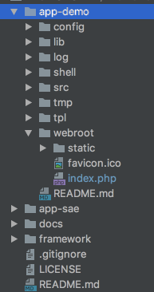

# 快速入门

为了让您更快的了解 `vframework` 的使用,本章节将带你建立一个test应用。

### 示例app

下图是一个示例application的目录结构,本示例代码在github上可下载到本地,详细请查看[传送门](https://github.com/dingusxp/vframework). 如果想知道目录结构的细节,请回到`框架简介`章节.




很简单的，你就可以创建一个application:

> 请提前配置好nginx指向本文件. 关于路由解析,和框架启动,后续会有详细说明,此处先不要关心这里.

```webroot/index.php
<?php

// 定义APP PATH
define('APP_PATH', dirname(dirname(__FILE__)));

// 开启调试模式
define('V_DEBUG', true);

try {
    // 载入框架
    require_once dirname(APP_PATH) . '/framework/V.php';
    // 启动app
    V::loadBootstrap('web', 'main')->run();
} catch (Exception $e) {
    echo defined('V_DEBUG') && V_DEBUG ? $e->getMessage() : 'Error';
}

```

启动框架后, 会进行路由解析, 默认解析到Index控制器的Index方法, 我们来看一下Index方法:

```src/Controller/Index.php
<?php
/**
 * controller index
 */

class Controller_Index extends Controller_Base {

    /**
     * 首页
     *
     * @return string
     */
    public function actionIndex() {
        // 文档标题~  就是网页标题哦
        $db_data = 'hello world from db';

        $tpl_data = array(
            'title' => $db_data
        );
        return $this->_view->renderLayout('index/index', 'layout', $tpl_data, View::LAYOUT_REBUILD_RESOURCE);
    }
}

```

很棒~ 你的应用已经开始运作了, 如果成功的话, 你将看到一个app-demo的页面。等你了解`vframework`的各部分组成之后,就可以愉快的使用它给你的应用添加功能了, 我们要的不是这么一个丑陋的网页, 对吧?

